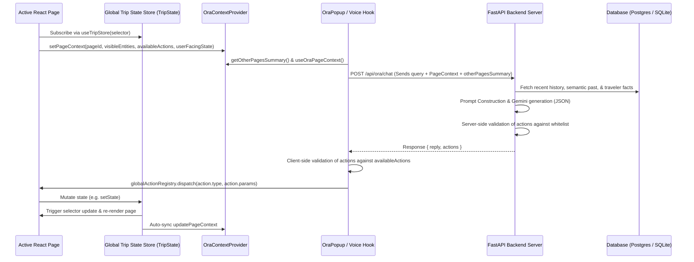

# ORA Agent Architecture

ORA has been upgraded from a basic chat companion into a full **Page-Aware, Action-Capable Agent**. Below is the architectural blueprint of the design, showing how pages register context, how state updates propagate across pages, and how the hands-free voice mode functions.

---

## 1. Data Flow Overview



---

## 2. Standardized Page Context Schema

Every page registers a `PageContext` via the React context provider.

### The PageContext Interface
Defined in [oraContext.tsx](file:///c:/Users/CHINMAYA%20M/Documents/Projects/Stellora-Web/frontend/src/types/oraContext.tsx):
```typescript
export interface PageContext {
  pageId: string                 // e.g. "trip-planner", "seven-pillars", "curate", "timeline"
  pageSummary?: string           // 1-line summary for otherPagesSummary
  visibleEntities: {
    type: string                 // e.g. "activity", "destination"
    id: string
    summary: string              // short human-readable description
    fullData?: Record<string, any> // COMPLETE entity details
  }[]
  availableActions: string[]     // Whitelisted actions this page accepts
  userFacingState: Record<string, any> // COMPLETE current state of user-relevant page data
  lastUpdated: number            // timestamp, so ORA can reason about staleness
}
```

### Size-Guard Truncation
To prevent oversized payloads from exceeding the backend's token window budget, the context provider runs a check:
* If the serialized `PageContext` exceeds **~2000 tokens** (approximated as **8,000 characters** in JSON form), the provider automatically truncates `visibleEntities[].fullData`, retaining only the lightweight `summary` descriptions.
* Truncation events are logged to the console to assist in debugging.

### Context Registration
Pages register context on mount and call `updatePageContext` on user interaction (debounced at 500ms to avoid unnecessary network payload updates during typing).

---

## 3. Global Trip State Store & Cross-Page Propagation

Stellora uses a custom Zustand-like store (`TripState`) defined in [tripStore.tsx](file:///c:/Users/CHINMAYA%20M/Documents/Projects/Stellora-Web/frontend/src/store/tripStore.tsx).

### Single Source of Truth
The store maintains the canonical trip data, ensuring that facts ORA learns or updates propagate automatically to all relevant components:
* Pages read trip data via the `useTripStore(selector)` hook.
* Subscribed components automatically re-render only when their selected slice changes.
* State is persisted to and synchronized from `localStorage` under `triparc:journey:draft:v1`.

### Store Interface
```typescript
export interface TripState {
  tripId: string
  destination: string
  dates: { start: string; end: string }
  budget: { amount: number; currency: string }
  itinerary: ItineraryDay[]
  travelers: TravelerInfo[]
  preferences: Record<string, any>
  activityLog: ActivityLogEntry[]
  activeDay?: number             // The active itinerary day currently shown (1-indexed)
}
```

---

## 4. Whitelisted Actions & State-Slice Ownership

Actions generated by ORA are routed through the central [actionRegistry.ts](file:///c:/Users/CHINMAYA%20M/Documents/Projects/Stellora-Web/frontend/src/agent/actionRegistry.ts). Handlers modify specific slices of `TripState` in the global store rather than mutating local page state directly.

### Registered Actions & State Ownership
| Action Name | Description | Target State Slice | Supported Parameters |
| :--- | :--- | :--- | :--- |
| `navigate` | Routes the user to a different application path. | UI Router State (dispatch event) | `path` |
| `update_itinerary` | Replaces or updates the list of timeline items. | `TripState.itinerary` or `TripState.destination` | `city`, `items` |
| `add_activity` | Adds a new activity stop to Day 1 of the trip. | `TripState.itinerary` | `title`, `time`, `location`, `durationMinutes` |
| `remove_activity` | Removes an activity by matching titles. | `TripState.itinerary` | `title` |
| `set_budget` | Updates the trip budget amount and currency. | `TripState.budget` | `amount`, `currency` |
| `add_destination` | Updates the travel destination. | `TripState.destination` | `destination` |
| `set_dates` | Sets the start and end dates for the trip. | `TripState.dates` | `startDate`, `endDate` |
| `update_preferences` | Updates traveler composition, dietary needs, or interests. | `TripState.preferences` | `composition`, `dietaryPrefs`, `interests`, `dayStart`, `dayEnd` |
| `synthesize_journey` | Generates the itinerary using the SevenPillars settings. | Pre-trip synthesis logic | None |
| `show_day` | Navigates/switches the visible day tab. | `TripState.activeDay` | `day` |

### Double-Sandboxed Execution
1. **Server-Side Validation**: `ora_ai.py` cross-checks actions generated by the LLM against the current page's `availableActions` whitelist. Unapproved actions are stripped immediately.
2. **Client-Side Validation**: `OraPopup.tsx` verifies that the incoming action is supported by the page's current whitelist before executing it via `globalActionRegistry.dispatch()`.

---

## 5. Activity Log & Undo Mechanism

Trust is paramount when an agent modifies user travel plans. 

* **Change Logging**: Every state change driven by ORA invokes `tripStore.logOraAction(action, params, sourcePageId)`. This logs the action, params, and a snapshot of the modified state slice (`previousStateSnapshot`) into the store.
* **Undo Trigger**: Users are notified of ORA-driven changes via a floating toast UI (`OraActivityIndicator`). Users can review what changed and click **Undo** to restore the previous state snapshot.

---

## 6. Hands-Free Voice Mode

Hands-free voice mode allows users to command ORA completely without keyboard inputs.

### Voice Pipeline State Machine
The pipeline, implemented in [useOraVoice.ts](file:///c:/Users/CHINMAYA%20M/Documents/Projects/Stellora-Web/frontend/src/hooks/useOraVoice.ts), manages five distinct states:
1. **`idle`**: The microphone is off.
2. **`wake_word`**: Continuous wake-phrase detection is active, scanning for *"Hey ORA"* (and its homophones like *"Hey Aura"* or *"Hey Ara"*).
3. **`listening`**: Actively recording user speech. Submits automatically after **4 seconds** of silence or upon hearing exit commands like *"stop"*.
4. **`thinking`**: Transcribing speech (using Web Speech API or falling back to Groq Whisper) and calling the chat backend.
5. **`speaking`**: Playing back ORA's response via Text-to-Speech (TTS).

```
[idle] ──(Hands-free Switch)──> [wake_word] ──("Hey ORA")──> [listening] ──(Silence / Timeout)──> [thinking] ──(API Response)──> [speaking] ──(Finished)──> [wake_word]
```

### Echo Loop Prevention & Mic Muting
To prevent ORA from listening to its own voice output (TTS) and triggering a loop:
* The wake-word listener is **fully aborted and deactivated** during both the `thinking` and `speaking` states.
* When TTS finishes speaking, a short cooldown is enforced before the wake-word listener re-engages.
* The microphone capture configures echo cancellation, noise suppression, and automatic gain control by default.
